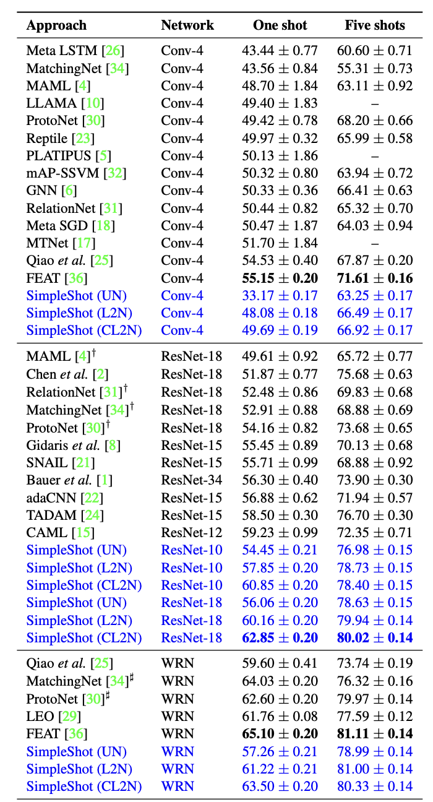

# cs4782_final_project

## Introduction

This repo attempts to reimplement the few-shot learner SimpleShot for image classification outlined in the paper *SimpleShot: Revisiting Nearest-Neighbor Classification for Few-Shot Learning* [1] by Wang, Chao, Wienberger, and Maaten. The paper shows how SimpleShot, despite its more simple architecture compared to more traditional few-shot learners that use meta-learning, can still produce similar performance by using two feature transformations: L2-normalization and centering.

## Chosen Result

We aimed to reproduce the 5-way 1-shot and 5-way 5-shot accuracies of SimpleShot, shown by the blue text in table, when classifying images in the dataset miniImageNet [2]. We also aimed to reproduce results that are comparable to the other few-shot learners on the table. The CNNs used for reimplementation were a standard 4-layer convolutional network (Conv-4) [3], residual networks (ResNet-10/18) [4], and a wide residual network (WRN-28-10) [5]. We also tested three feature transformations: unnormalized (UN), L2-normalization (L2N), and centering with L2-normalization (CL2N). 

## GitHub Contents

Our project is split into `code/`, `data/`, `results/`, `poster/`, `report/`, `LICENSE`, and `.gitignore`. Since the dataset is too large to push to git, there is a `README.md` in the data folder with instructions on how to download the data.

We used `test_notebook.ipynb` to run our model on Google Colab, `train_eval.py` for the main train/eval loop, `models.py` for the SimpleShot model, `networks.py` for the various CNNs used, and `data_collector.py` to collect and split the data into correct sets.

## Reimplementation Details

We decided to focus on one dataset, miniImageNet, which has 100 classes and 600 examples per class. We split the dataset into 64 base training classes, 16 validation classes, and 20 test classes. Images were resized to be 84 x 84 pixels, and we used center cropping. We then passed images through a CNN (Conv-4, ResNet-10/18, or WRN-28-10) for feature extraction.

To train the CNN, we used a linear classifer on the features with cross-entropy loss. We trained for 90 epochs and used SGD to make gradient updates on the CNN and linear classifer. We start with a learning rate of 0.1 and then reduce it by a factor of 10 at epochs 45 and 66. We did 1-shot and 5-shot 5-way tasks and evaluated based on percentage accuracy of predicted labels.

For inference and testing, we passed images through the CNN to get their feature vectors and perform feature transformations (UN, L2N, or CL2N) on those feature vectors before doing nearest neighbors classification and getting the predicted class.

Due to a lack of time and clarity in the paper's description of certain steps, the only modifications we made to the approach from the original paper were that we left out implementing MobileNet and DenseNet and only tested SimpleShot on one of the three datasets used in the paper.

## Reproduction Steps

To reproduce our implementation, first follow the steps in the `data/README.md` to download the data from Google Drive. After that, create a Python environment with the version `3.10.X`. Required libraries to pip install include: `torch`, `numpy`, `tqdm`, `learn2learn`, and `torchvision`.

To run SimpleShot, either run/modify the cells in `code/test_notebook.ipynb` on Google Colab using their T4 GPU, or run `python code/train_eval.py --network [model_name]` to run SimpleShot with network `model_name`. Possible arguments for `model_name` are `Conv-4`, `ResNet-10`, `ResNet-18`, or `WRN`.

## Results/Insights

Our results are shown in the table below. Comparing them to the original paper’s results at the beginning, we see that we achieved slightly lower results. Even with inferior performance, our reimplemented results still reinforce the findings of the original paper [1] that centering and L2-normalization significantly improve few-shot classification performance, as we see how accuracy from the table increases as we go from UN to L2N to CL2N. Also, our results are still on par with some produced by the other few-shot learners that use meta-learning as shown in the table at the start. This again supports the paper’s findings of how SimpleShot can be just as good as these more traditional few-shot learning algorithms.

## Conclusion

Our results support the hypothesis that the SimpleShot, when paired with proper feature normalization, such as CL2N, can achieve comparable performance to meta-learning approaches in few-shot learning tasks. The SimpleShot methods provide significant advantages in simplicity compared to meta-learning.

## References

[1] Wang, Y., Chao, W.-L., Weinberger, K. Q., & van der Maaten, L. (2019). SimpleShot: Revisiting nearest-neighbor classification for few-shot learning. arXiv. https://arxiv.org/abs/1911.04623

[2]  O. Vinyals, C. Blundell, T. Lillicrap, D. Wierstra, et al. Matching networks for one shot learning. arXiv. https://arxiv.org/abs/1606.04080

[3] J. Snell, K. Swersky, and R. Zemel. Prototypical networks for few-shot learning. arXiv. https://arxiv.org/abs/1703.05175

[4] K. He, X. Zhang, S. Ren, and J. Sun. Deep residual learning for image recognition. arXiv. https://arxiv.org/abs/1512.03385

[5] Zagoruyko, S., & Komodakis, N. (2016). Wide Residual Networks. arXiv. https://arxiv.org/abs/1605.07146

## Acknowledgements

Credits to the course staff and professors of CS 4782 (Deep Learning) in giving the knowledge, guidelines, and support necessary to complete this project.
