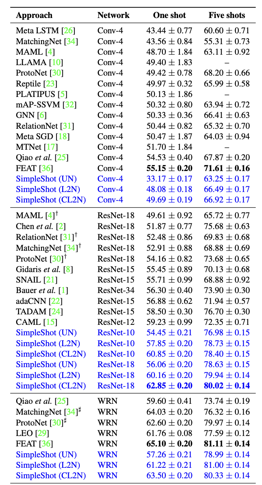
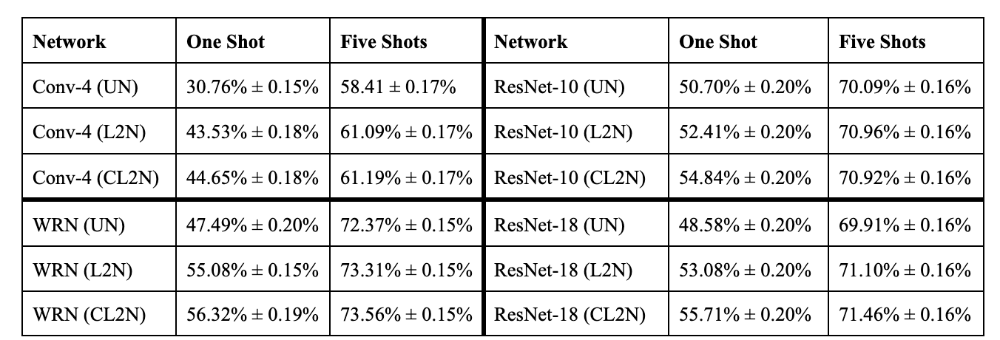

# cs4782_final_project

## Introduction

Our project was re-implementing SimpleShot (Wang et al.), a model that challenges the notion that more complexity is always better, and explores if a more naive solution can perform comparably. SimpleShot focuses on supervised training on base cases and nearest neighbor classification for novel classes, adding two critical feature transformations during testing: L2-normalization and centering.

## Chosen Result

We aimed to reproduce the results of using the architecture described in SimpleShot (Wang et al.) for different feature transformations (UN, L2N, CL2N) across various CNN backbones (Conv-4, ResNet-10, ResNet-18) on 5-way 1-shot and 5-way 5-shot classification tasks using the miniImageNet dataset. Specifically, we focused on validating whether simple feature transformations could make nearest-neighbor classifiers competitive with meta-learning approaches, as the original paper claimed.

## GitHub Contents

Our project is split into `code/`, `data/`, `results/`, `poster/`, `report/`, `LICENSE`, and `.gitignore`. Since the dataset is too large to push to git, there is a `README.md` in the data folder with instructions on how to download the data.

We used `test_notebook.ipynb` to run our model, `train_eval.py` for the main train/eval loop, `models.py` for the SimpleShot model, `networks.py` for the various CNN's used, and `data_collector.py` to collect and split the data into correct sets.

## Re-implementation Details

We decided to focus on one dataset, miniImageNet, which has 100 classes and 600 examples per class. We split the dataset into 64 base training classes, 16 validation classes, and 20 test classes. Images were resized to be 84 x 84 pixels, and we used center cropping. We then passed images through a model backbone (a CNN - Conv-4, ResNet-10 or -18) for feature extraction.

For testing, we also perform feature transformation (UN, L2N, CL2N) on images before doing nearest neighbors classification and getting the predicted class.

We trained for 90 epochs and used SGD and cross-entropy loss. We starts with a learning rate of 0.1, then is reduced by a factor of 10 at epochs 45 and 66. We did 1-shot and 5-shot 5-way tasks and evaluated based on percentage accuracy of predicted labels.

## Reproduction Steps

To reproduce our implementation, one would need to first follow the steps in the `data/README.md` to download the data from Google Drive. After correctly downloading the data and putting it in the `data` folder, you have to create a Python environment with the version `3.10.X`. Required libraries to pip install include: `torch`, `numpy`, `tqdm`, `learn2learn`, and `torchvision`.

To run the code, run the cells of the `test_notebook.ipynb` with GPU (eg: Google Colab's T4).

## Results/Insights

Our results reinforce the findings of the original SimpleShot (Wang et al.) paper: feature normalization, particularly CL2N, significantly improves few-shot classification performance. Despite slightly lower testing accuracies for all settings compared to the original paper, our results still confirm the impact of feature transformation techniques and the number of shots on model performance. While ResNet-10 and ResNet-18 achieve higher accuracy overall, Conv-4 remains more competitive relative to the original paper’s results, given its simplicity. The impact of normalization is most pronounced in 1-shot settings, where structured embeddings are critical.

## Conclusion

Our results support the hypothesis that simple nearest-neighbor classifiers, when paired with proper feature normalization (such as Centering + L2N or CL2N), can achieve comparable performance to meta-learning methods in few-shot learning tasks. The SimpleShot methods provide significant advantages in training efficiency and simplicity compared to meta-learning.

## References

[1] Wang, Y., Chao, W.-L., Weinberger, K. Q., & van der Maaten, L. (2019). SimpleShot: Revisiting nearest-neighbor classification for few-shot learning. arXiv. <https://arxiv.org/abs/1911.04623>

[2] Zagoruyko, S., & Komodakis, N. (2016). Wide Residual Networks. arXiv. <https://arxiv.org/abs/1605.07146>
[TO ADD OTHER NETWORKS??]

## Acknowledgements

Credits to the course staff and professors of CS 4782 (Deep Learning) in giving the knowledge, guidelines, and support necessary to complete this project.
