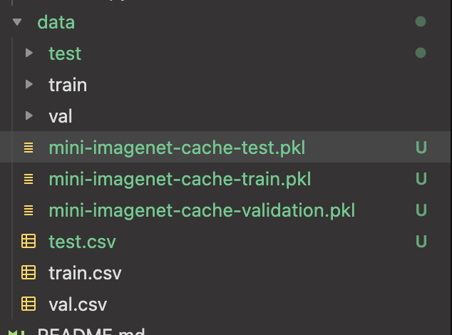

# How to get data

Because the data is too large to push, you will have
to download the data yourself. Here are steps to do so:

1. Download data from [here.](https://drive.google.com/drive/u/0/folders/137M9jEv8nw0agovbUiEN_fPl_waJ2jIj)
2. Put data in the `data` directory.
3. Rename `mini-imagenet-cache-val.pkl` to
`mini-imagenet-cach-validation.pkl`.

